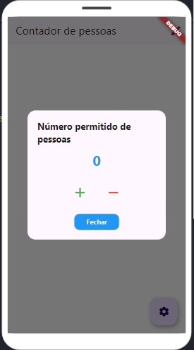
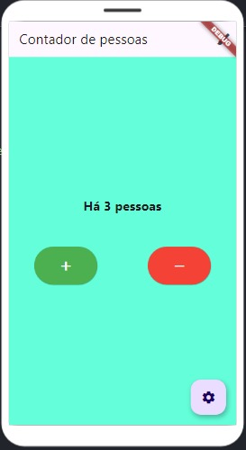
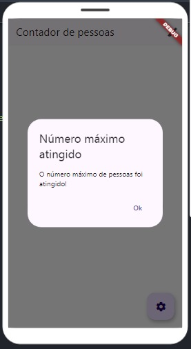

# 📌 Aplicativo Count

> Este aplicativo foi desenvolvido para auxiliar no controle de acesso a ambientes fechados, garantindo que o número de pessoas dentro do espaço não ultrapasse o limite permitido.

## 🚀 Funcionalidades

- 🔹 Permite que um funcionário registre a entrada e saída de pessoas no ambiente..
- 🔹 Exibe em tempo real a contagem atual de pessoas no local.
- 🔹 Alerta o usuário com uma mensagem na tela caso o limite máximo seja excedido.

## 🖼️ Capturas de Tela

# Interface de Usuário  
O aplicativo possui uma interface simples e intuitiva, permitindo que o funcionário registre a entrada e saída de pessoas facilmente.  

  

---

## Configuração de Limite  
O usuário pode definir o número máximo de pessoas permitidas no ambiente para garantir que a ocupação não ultrapasse o limite seguro.  

  

---

## Alterar Cor de Fundo  
O aplicativo permite a personalização da interface, incluindo a alteração da cor de fundo para melhor visualização.  

  

---

## Alerta ao Atingir o Limite  
Caso o número de pessoas chegue ao limite definido, um alerta visual será exibido na tela principal para informar ao funcionário.  

  

## 👥 Desenvolvedores

| Nome | Matrícula |
|------------|--------------|
| Eduardo Evaristo | 123100051 |
| Rafael Miranda | 123100009 |

📌 *Projeto desenvolvido para colocar em prática o aprendizado de desenvolvimento em ambiente mobile.

